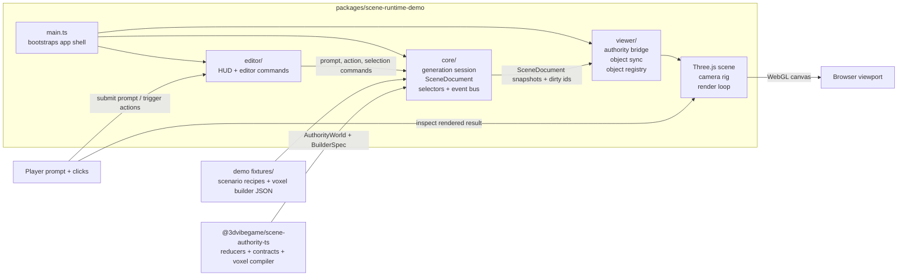

# 3d vibe game

👷

- <https://3dvibegame.com>

Current vertical slice:
`text prompt -> staged generation session -> compiled object -> grace edits -> released object`

## Architecture

The current prototype lives in `packages/scene-runtime-demo`. It keeps scene truth in `core`, tool orchestration in `editor`, and Three.js projection in `viewer`, while `@3dvibegame/scene-authority-ts` owns the authoritative object lifecycle and voxel-to-builder compilation rules.



`@3dvibegame/scene-runtime-ts` remains an adjacent workspace package for normalized planning artifacts and render-draft utilities; it is not yet the main demo loop shown above.

## Project State

[`CURRENT_STATE.md`](CURRENT_STATE.md) is the source of truth for the current slice tracker, completed work, next steps, and latest verification status.

Keep stable setup and architecture notes in this README. Keep dated design plans in `docs/plans/`. Keep the broader product and backend direction in `/Users/gianpaj_it/github/gianpaj/ideas/vibe-world`.

## Workspace packages

- `packages/website` — current placeholder marketing site
- `packages/scene-runtime-ts` — TypeScript consumer port of the Python `scene_runtime` contract
- `packages/scene-runtime-demo` — plain Three.js demo for inspecting runtime fixtures in the browser

## Demo commands

```bash
pnpm demo:dev
pnpm demo:build
pnpm typecheck
```

## Manual deploy

`packages/scene-runtime-demo` is deployed as a Cloudflare Pages project named `3dvibegame` in account `f993cefa62ff85589a32173f0813fbad`.

Build and deploy it manually from the repo root:

```bash
pnpm demo:build
CLOUDFLARE_ACCOUNT_ID=f993cefa62ff85589a32173f0813fbad \
  wrangler pages deploy packages/scene-runtime-demo/dist \
  --project-name 3dvibegame \
  --branch master
```

Useful URLs:

- production domain: <https://3dvibegame.com>
- Pages dashboard: <https://dash.cloudflare.com/f993cefa62ff85589a32173f0813fbad/pages/view/3dvibegame>

Notes:

- The old `3dvibegame` Worker in Cloudflare Workers is separate from the Pages project.
- As of 2026-04-01, the custom domain `3dvibegame.com` is attached in Cloudflare but still shows `pending`. If the custom domain is not serving yet, use `https://3dvibegame.pages.dev`.
