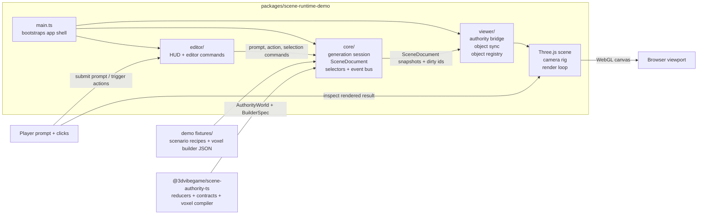

# 3d vibe game

👷

- <https://3dvibegame.com>

Current vertical slice:
`text prompt -> browser Gemini -> voxel operations -> worker compile -> live object -> shared-room editing`

https://github.com/user-attachments/assets/17322171-449d-4279-a8c7-0218190edb77

## Clients

There are two browser clients:

- **`packages/3dvibegame-web`** — the deployable player app (React + React Three Fiber). Real-time multiplayer via SpacetimeDB, LLM-authored voxel geometry (the browser calls Gemini directly with a player-supplied key, then the AI worker compiles the result), and shared-room editing: prompt to create, then select / move (WASD) / rotate / scale / delete with exclusive 30s edit locks.
- **`packages/scene-runtime-demo`** — the original plain Three.js dev harness for inspecting runtime fixtures and exercising the full HUD.

## Architecture (dev harness)

`packages/scene-runtime-demo` keeps scene truth in `core`, tool orchestration in `editor`, and Three.js projection in `viewer`, while `@3dvibegame/scene-authority-ts` owns the authoritative object lifecycle and voxel-to-builder compilation rules.



`@3dvibegame/scene-runtime-ts` remains an adjacent workspace package for normalized planning artifacts and render-draft utilities; it is not yet the main demo loop shown above.

## Project State

[`CURRENT_STATE.md`](CURRENT_STATE.md) is the source of truth for the current slice tracker, completed work, next steps, and latest verification status.

Keep stable setup and architecture notes in this README. Keep dated design plans in `docs/plans/`. Keep the broader product and backend direction in `/Users/gianpaj_it/github/gianpaj/ideas/vibe-world`.

## Workspace packages

- `packages/3dvibegame-web` — deployable player app (React + React Three Fiber, multiplayer)
- `packages/scene-runtime-demo` — plain Three.js dev harness for inspecting runtime fixtures in the browser
- `packages/scene-authority-ts` — authoritative object lifecycle reducers, contracts, and the voxel-to-builder compiler
- `packages/ai-planning` — shared create/voxel schemas, system prompts, and deterministic plan/voxel-to-builder conversion
- `packages/ai-worker` — external Node AI worker (`POST /generate` prompt path, keyless `POST /compile` path)
- `packages/world-backend` — SpacetimeDB module (worlds, presence, object lifecycle, locks, world settings)
- `packages/scene-runtime-ts` — TypeScript consumer port of the Python `scene_runtime` contract
- `packages/website` — placeholder marketing site

## Commands

```bash
# Player app (3dvibegame-web)
pnpm web:dev
pnpm web:build
pnpm web:test

# Dev harness (scene-runtime-demo)
pnpm demo:dev
pnpm demo:build

# Backend smokes + typecheck
pnpm phase3:smoke
pnpm typecheck
```

The player app expects a Gemini key (entered in-app) and, for shared geometry compilation, `VITE_AI_WORKER_URL`; multiplayer needs `VITE_SPACETIMEDB_URI` + `VITE_SPACETIMEDB_DATABASE` and a published `world-backend` module. See `packages/3dvibegame-web/.env.example`.

## Manual deploy

Both browser clients are Vite SPAs that build to `dist/` and deploy to the same Cloudflare Pages project `3dvibegame` (account `f993cefa62ff85589a32173f0813fbad`) → <https://3dvibegame.com>. Pages uses `packages/3dvibegame-web/public/_redirects` for SPA fallback; the player app also ships a `vercel.json` if you'd rather host it on Vercel.

For the multiplayer backend (SpacetimeDB + AI worker) on a VPS with Coolify, see [`docs/deploy-backend.md`](docs/deploy-backend.md) (compose: `deploy/spacetimedb/`, Dockerfile: `packages/ai-worker/Dockerfile`).

### Player app (`3dvibegame-web`)

`VITE_*` values are baked at **build time**, so set the production backend before building. The Gemini key is entered in-app at runtime (not an env var). Run from the repo root:

```bash
VITE_SPACETIMEDB_URI=https://stdb.3dvibegame.com \
VITE_SPACETIMEDB_DATABASE=3dvibegame \
VITE_AI_CLIENT_MODE=browser-gemini \
pnpm web:build

CLOUDFLARE_ACCOUNT_ID=f993cefa62ff85589a32173f0813fbad \
  wrangler pages deploy packages/3dvibegame-web/dist \
  --project-name 3dvibegame \
  --branch master
```

Deploying to `--project-name 3dvibegame` serves the player app on `3dvibegame.com`, **replacing the dev harness**. To keep both, use a different `--project-name` (new `*.pages.dev`, attach a custom domain separately). Optional: add `VITE_AI_WORKER_URL=https://ai.3dvibegame.com` to compile geometry on the worker instead of in the browser. Without `VITE_SPACETIMEDB_*` the app runs local-only (no multiplayer).

### Dev harness (`scene-runtime-demo`)

```bash
pnpm demo:build
CLOUDFLARE_ACCOUNT_ID=f993cefa62ff85589a32173f0813fbad \
  wrangler pages deploy packages/scene-runtime-demo/dist \
  --project-name 3dvibegame \
  --branch master
```

Useful URLs:

- production domain: <https://3dvibegame.com>
- Pages dashboard: <https://dash.cloudflare.com/f993cefa62ff85589a32173f0813fbad/pages/view/3dvibegame>

Notes:

- The old `3dvibegame` Worker in Cloudflare Workers is separate from the Pages project.
- As of 2026-04-01, the custom domain `3dvibegame.com` is attached in Cloudflare but still shows `pending`. If the custom domain is not serving yet, use `https://3dvibegame.pages.dev`.
